# Using Signal Tap for Lab 3

## Overview

This document describes how to use SignalTap, Altera's embedded logic analyzer. At a high level, SignalTap is a component of Quartus. When run, it will add some debug logic to your design; this logic will record a trace of important signals in on-chip memory as your design is running. Later, after the design has stopped running, the tool will let you access this information and display it (using waveforms) so you can see how your design operated. This is useful to help you understand code, as well as to help you find design errors when your simulation does not match the actual behaviour in the FPGA.

Before proceeding, it is important to understand why this is different than simulation. Using Modelsim you can simulate your design. You can add signals to a waveform window, and observe their behaviour during a simulated run of the design. SignalTap is different: it allows you to observe the behaviour of selected signals during an actual run of the design on the FPGA. This has many advantages: in Lab 4, suppose you want to observe what happens when the ball hits a paddle. Running the design in simulation long enough for this to happen is infeasible. As a quick calculation, suppose in the real implementation, it takes 20 seconds before the ball hits the paddle, and you are running at 50MHz, this would translate to one billion cycles. One billion cycles is far beyond the capabilities of any simulator (even if you had enough memory to store all the data, it would take days to simulate).

The downside of using SignalTap is that there is limited on-chip memory to store traces. You might (if you are lucky) be able to record hundreds of cycles. As a result, it is important to use a trigger to indicate when the instrumented hardware should start recording data. The trigger condition is similar to a trigger you might have used in a physical logic analyzer in the lab.

This document will take you through using SignalTap using the Lab 3 design that has been given to you. It is **strongly suggested** that you work through this, since it may be an important tool when debugging future designs.

## Tutorial

**Step 1.** Create a project for the design that has been given to you. Make sure to include the VGA files. Compile the project and read in your signal assignments.

**Step 2.** Before using SignalTap on the Web edition of the software, you have to turn on the TalkBack feature (this sends information about how you are using the tool to Altera, but nothing else — if you don't like this, you can turn it off as soon as you are done using SignalTap). To turn on the TalkBack feature, choose Tools->Options-> Internet Connectivity, and click on TalkBack Options. Make sure "Enable Sending Talkback Data to Altera" is checked, and press OK (you may need to give permission to the software to do this). This is shown in the following diagram.

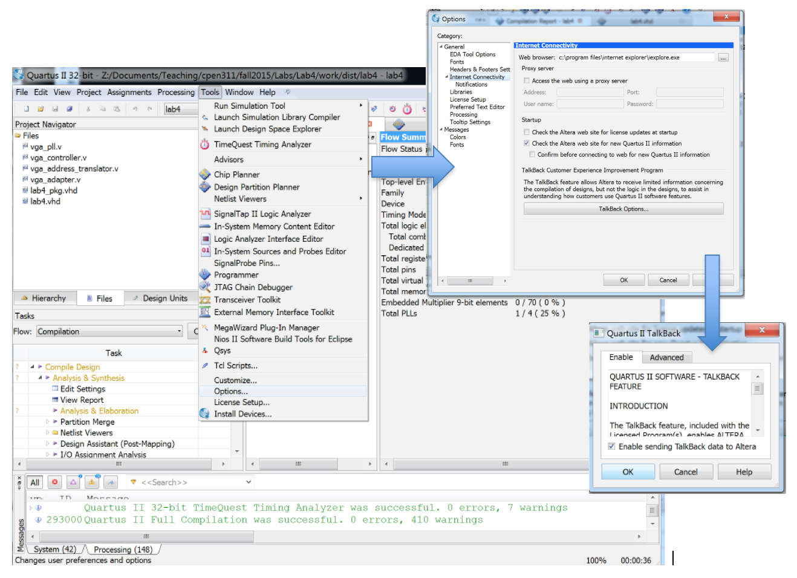

**Step 3.** Make sure your project has been compiled. Don't forget the pin assignments!

**Step 4.** Choose Tools->SignalTapII. This will open the SignalTapII window. You should see something like this:

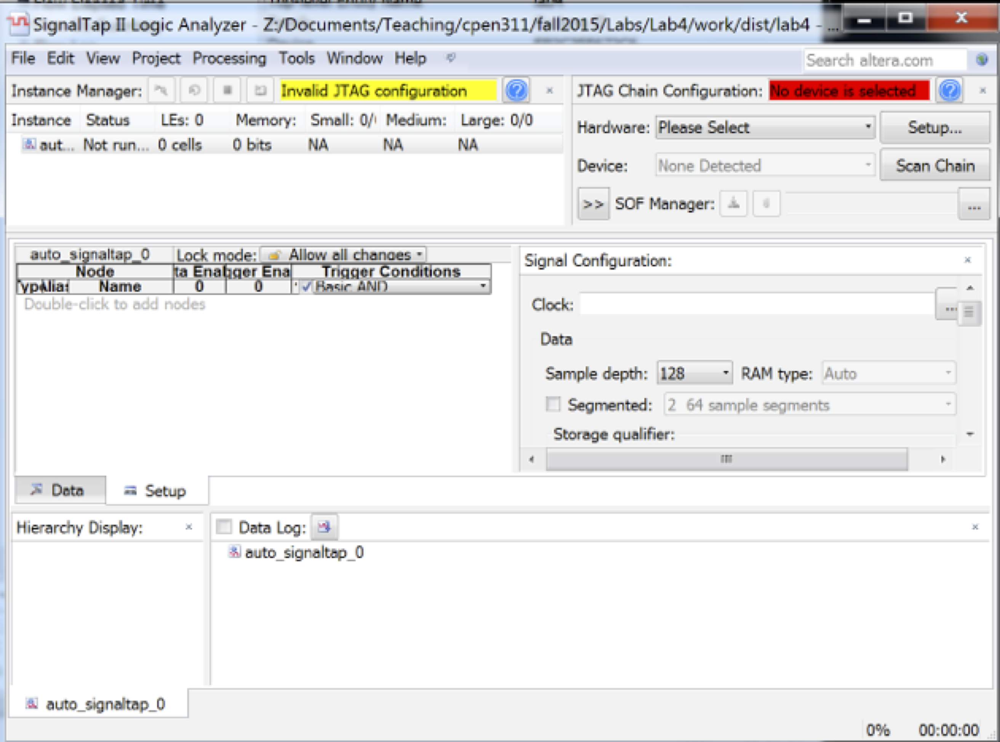

**Step 5.** Now you need to tell the tool about the hardware that you are using. In the JTAG Chain Configuration panel (top right), click on Setup and then choose the USB Blaster, as shown below. You should see the message JTAG Ready in the top right of the SignalTap window.

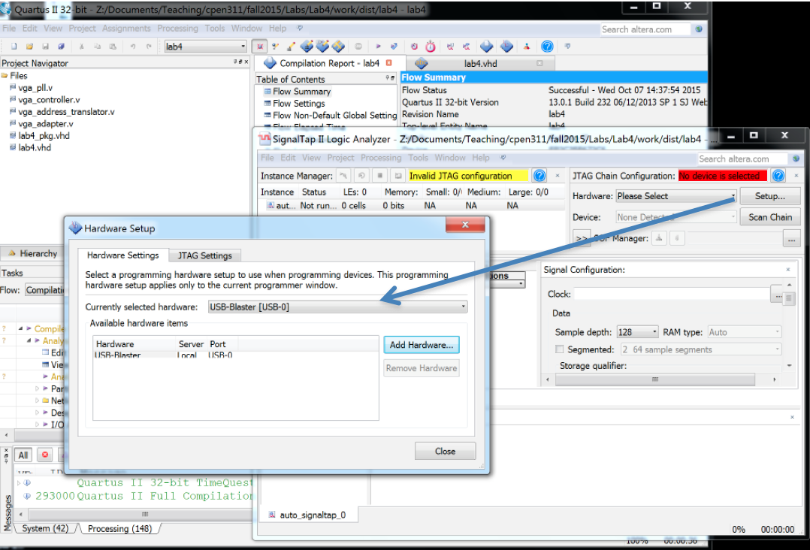

**Step 6**. The next step is to indicate which signals in the design you would like to analyze. Later, when you run the design, these are the signals whose behaviour will be recorded in the on-chip memory. There is a tradeoff here: the more signals you select for recording, the shorter the duration of each trace will be (since there is a fixed amount of on-chip memory).

To add signals, double click on the panel that says "Double-Click to add nodes". This will open the Node Finder window, as shown below.

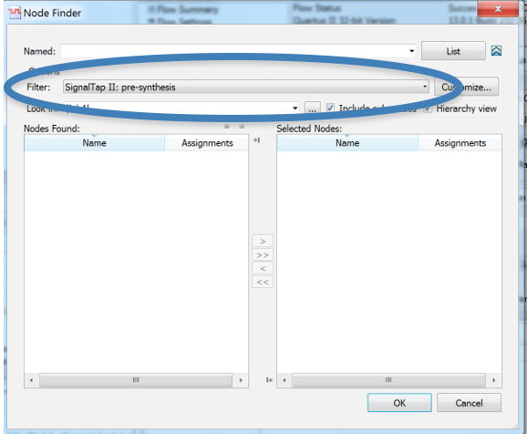

If the Filter option is not showing, click on the arrow beside List. From the Filter option, choose SignalTap: pre-synthesis (circled above). You want to choose "pre-synthesis" (as opposed to "post-synthesis") because you would rather see the signal names as they appear in your design, rather than the signal names as they appear after the synthesis process has happened (the latter names may be mangled and harder to recognize). Once you have chosen "pre-synthesis", press List and you should see something like:

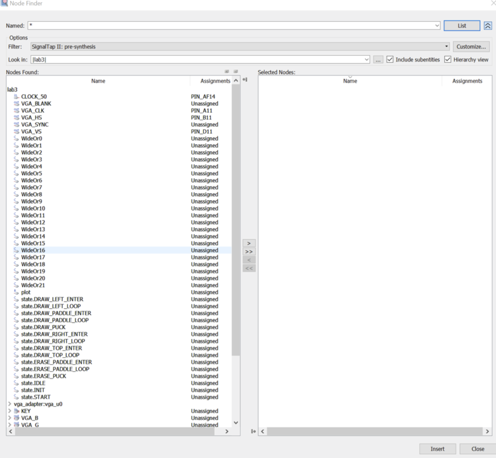

The Nodes Found panel lists all the nodes (signals) that it found in your design. Scroll through this, and see how many signals you can recognize from the design. You can now select any number of signals and use the > button which will add them to the panel on the right (the signals listed on the right are the ones that will be recorded in on-chip memory when the circuit is run). For the purposes of this demo, add the following signals:

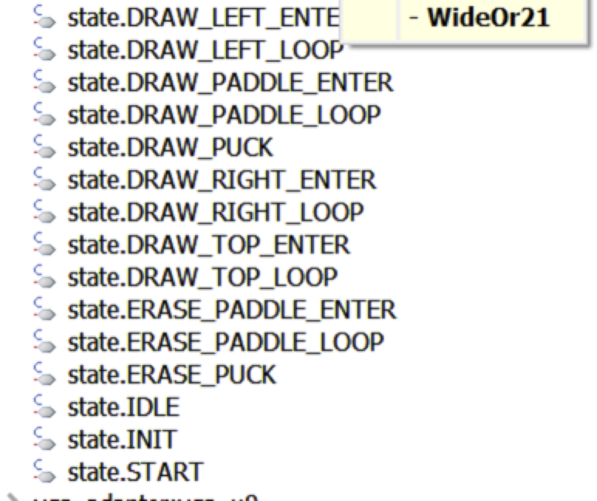

In either case, these are the state bits (one bit per state, because, as we discussed in class, Quartus uses one-hot encoding for state machines). Add them to the Selected Nodes window. Also add:

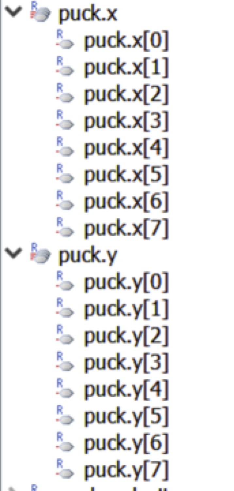

These signals store the location of the ball on the screen. Once you have done this, you should see something similar to what is shown below.

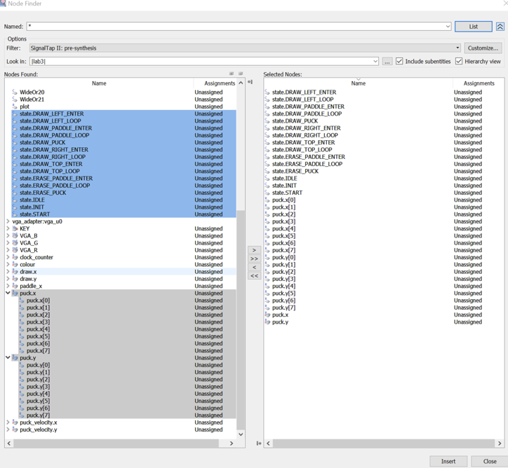

Hit OK, or INSERT and CLOSE (depending on the version of the software you are using).

**Step 7.** The next step is to specify the clock that we should sample on. In this design, we really only have one clock to sample on: CLOCK_50. To specify it, choose the “...” after the Clock line in the Signal Configuration panel. This will open up a node finder as before.  Hit LIST, and scroll down and find CLOCK_50, and add it to the selected nodes (giving something like this):

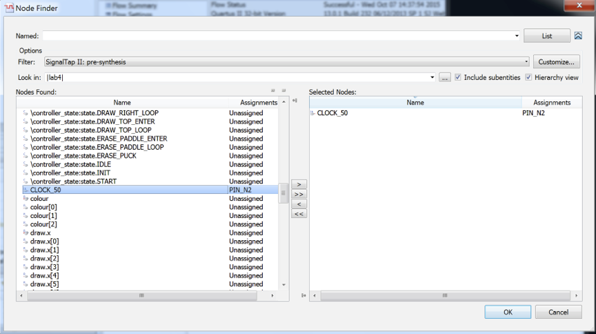

Hit OK, and your window should look like this, with the clock specified.

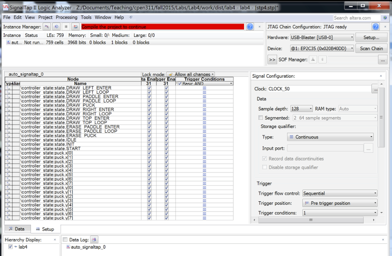

**Step 8**: Now you have to specify when you want the hardware to start recording these signals (the trigger condition). Any of the signals you have selected can be used as part of a Trigger Condition. Suppose we decide that we want to set the trigger so that the hardware starts recording signal behaviour whenever we enter state ERASE_PADDLE_ENTER (have a look at the code to see what this means). To do this, find state.ERASE_PADDLE_ENTER in the list of selected signals in the SignalTap window. Beside the signal name, you will find a column Trigger Conditions. Right now, they are all showing a "don't care pattern" which indicates that the signal does not participate in the trigger. Since we want signal state.ERASE_PADDLE_ENTER to participate in the trigger condition, right-click on the don't care pattern beside state.ERASE_PADDLE_ENTER, as shown in the following diagram:

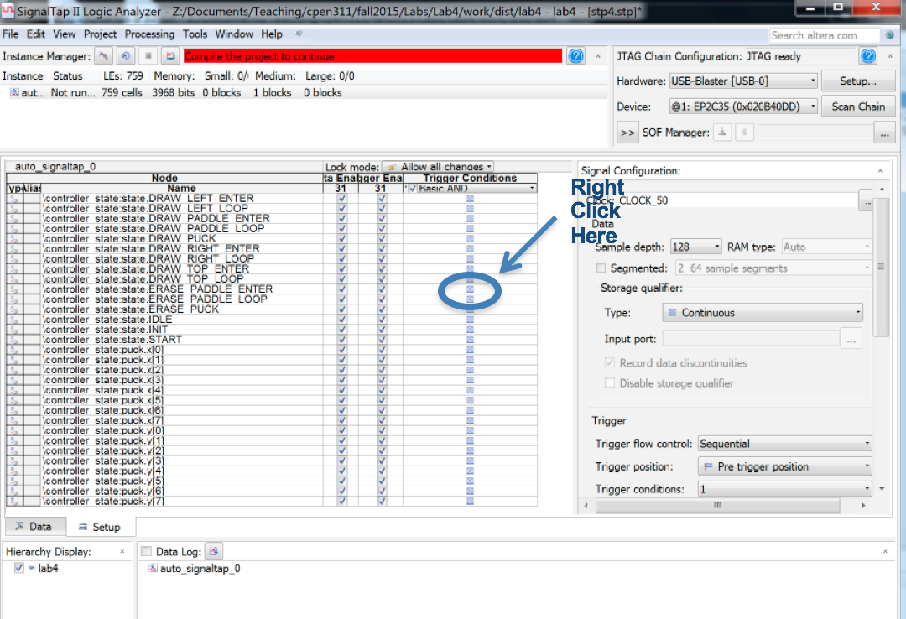

From the pull down menu, choose "High", since we want the hardware to trigger whenever this signal goes high (which means we have entered the state).

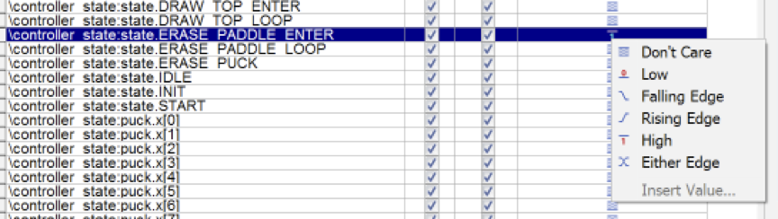

**Step 9**: Save the SignalTap specification by choosing Save in the SignalTap top menu. You will get a question asking if you want to add it to the current project; say Yes (if you don't get this, you can add it manually).

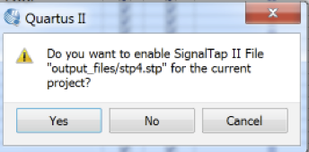

**Step 10**: SignalTap will insert circuitry into your design, so you need to recompile your design. Go back to Quartus and recompile and then download the design to the FPGA (don't forget your pin assignments!). If you are really observant, you might notice that the number of logic elements and memory elements used has gone up; this is due to the extra logic and memory in the circuitry that SignalTap added.

**Step 11**: Now go back to the SignalTap window, and choose Processing->Run Analysis.  You will see (for a short time) the message "Acquisition in Progress" and then, once the trigger condition occurs (in this case, once the state machine reaches the ERASE_PADDLE_ENTER state) you will see waveforms appear that look something like this:

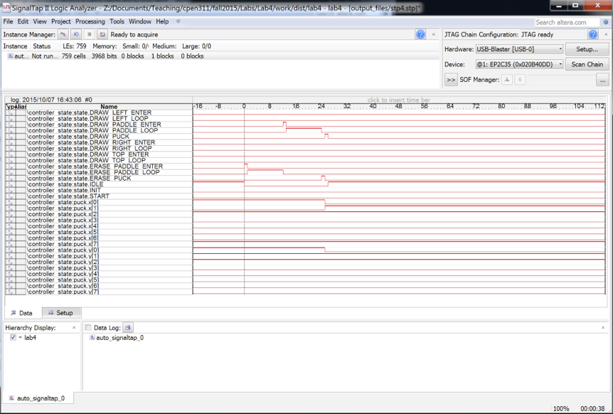

To make this more readable, you can highlight puck_x[0] to puck_x[7] and right-click->Group. You can do the same for puck_y[0] to puck_y[7]. (You can also do the same for the state bits, but don't do that for now). Your waveform will look as follows (you may need to zoom out to see the waveforms):

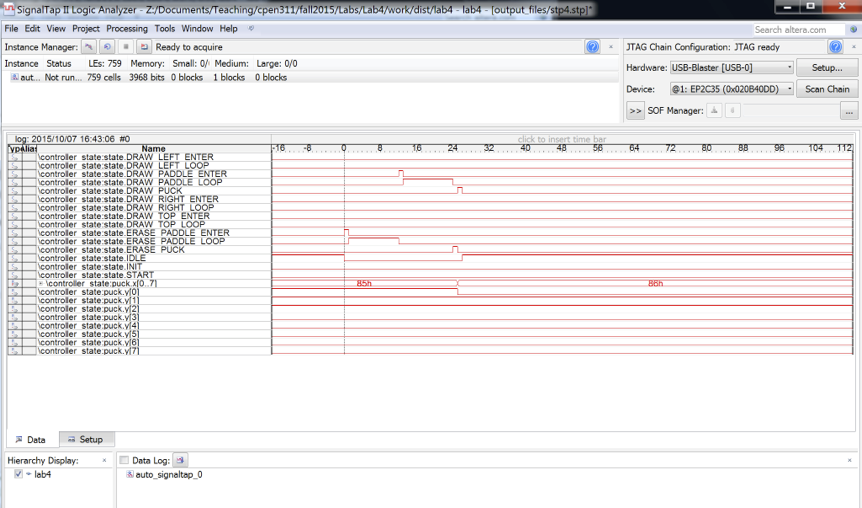

Looking closely at the waveforms, the vertical line is the trigger point. We can see that it triggered as soon as ERASE_PADDLE_ENTER went high. Further, we can see that this went high for one clock cycle. After ERASE_PADDLE_ENTER went low, ERASE_PADDLE_LOOP went high, and we stayed in this state for several cycles (look at the code to see why we did this… it is because it takes multiple cycles to finish drawing the paddle). We can then see that we went into DRAW_PADDLE_ENTER for one cycle and DRAW_PADDLE_LOOP for multiple cycles. Then we went into ERASE_PUCK and then DRAW_PUCK, each for one cycle. Notice that, during ERASE_PUCK, the x and y position of the puck was updated (as would be expected). Finally, notice that after DRAW_PUCK, the state machine went into IDLE and stayed there for the remainder of the acquisition period. Look at the code to see that this is the correct behaviour.

**Step 12**: Another example (debugging): Now consider another example. In this example, you will purposely add a bug into your design and observe the behaviour. To add the bug, look in file `lab3.sv` and find the line:

    if ((puck.x >= paddle_x) & (puck.x <= paddle_x + PADDLE_WIDTH)) begin

and replace it with (remove the "+ PADDLE_WIDTH"):

    if ((puck.x >= paddle_x) & (puck.x <= paddle_x)) begin

With this change, the ball will only bounce off the paddle if it hits the left-most pixel, otherwise it will go right through the paddle. Compile and download and run the design to see that this is indeed the case.

Now suppose you want to find this bug. You realize something wrong is happening when the ball reaches the bottom line on the screen (line 117 = 0x75).

Go back to your SignalTap window (and make sure you are displaying the Data tab (near the bottom). Add puck_velocity.x[0] .. puck_velocity_x[7], and puck_velocity.y[0] .. puck_velocity_y[7] to the list of signals you are observing (Edit->Add Nodes). For each of the buses you have added, highlight all 8 wires in the bus and right-click->Group. This will lead to something like this:

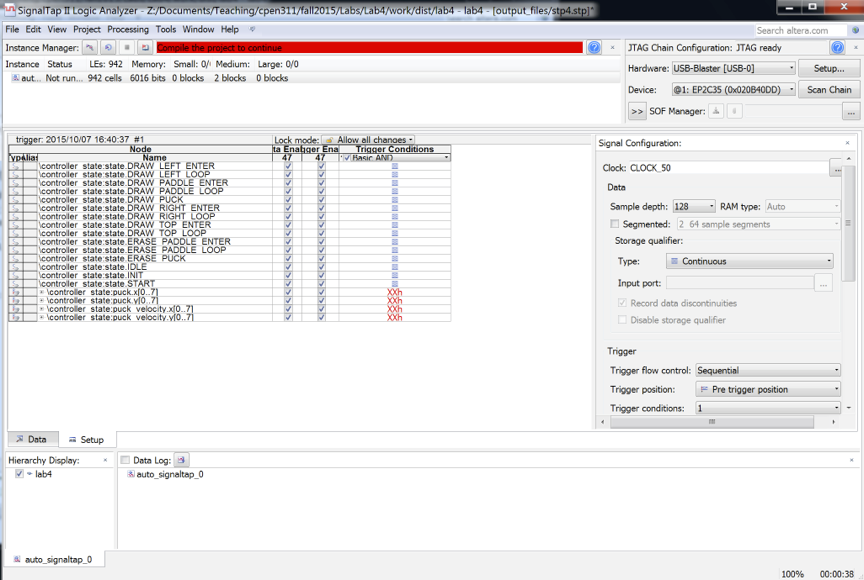

Next, we want to set a triggering condition. First, turn off the old trigger (if it is still there). Do this by right-clicking next to PADDLE_ENTER and choose DON'T CARE (undoing the trigger condition you set in Step 8). Then, right-click the XXh next to puck.y[0..7] and change it to 75. Now, the circuit will start recording when the puck y location reaches 0x75 (which is 117 in decimal).  The list of signals will look as follows:

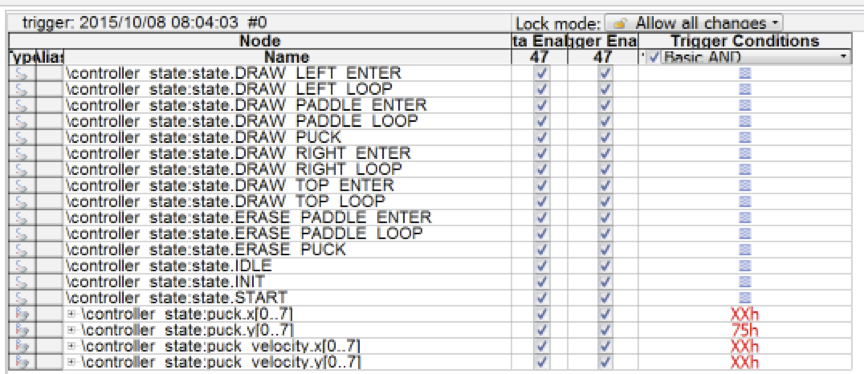

Then choose Save in the SignalTap window, go back to Quartus, recompile your project, and re-download it to the Altera board (note that every time you add more signals to be observed, you need to recompile your project. As the ball approaches the paddle, position the paddle so that the ball hits the right-side of the paddle. Normally, we would expect the ball to bounce off the paddle, but because of the bug we added above, we notice the system resets. This is the incorrect behaviour we want to correct.

In order to find the bug, understanding what is happening inside the circuit is often useful. Reset the circuit running on the Altera board (you can use the reset key KEY3), go back to the SignalTap window (you might have to quickly switch displays if you have only one), and choose Processing->Run_Analysis. Go back to your game, and once again, position the paddle so that the ball hits the right side of the paddle. Once the ball hits the bottom row, you will see that a waveform appears in the SignalTap window that should look like this (you may have to zoom out):

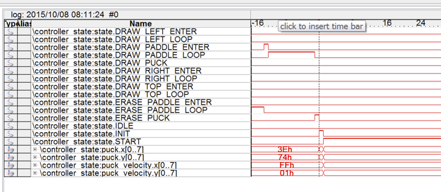

Looking at this, you can see what is happening. When the y position is 74h, the system goes into the INIT state (which clears the screen and starts the game again). If the design was operating correctly, we would not have expected the system to reset at this point.  If you were actually debugging this circuit, this might give you a clue that there is a problem with the IF statement that sets the next state logic.

Go back to the VHDL or Verilog code and fix the bug you inserted above, and re-run the analysis. Run the game, choose Processing->Run Analysis, and play the game, once again hitting the ball with the paddle. Once you hit the ball, you should see a waveform something like:

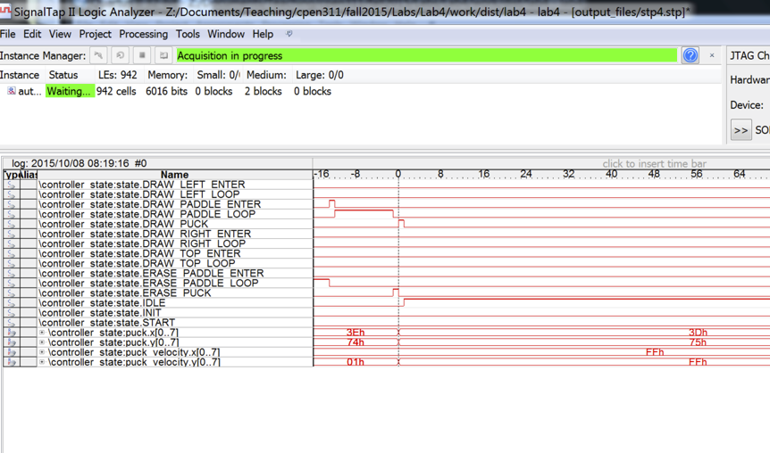

In the above, you can see that when the Y location of the ball is 74h, after the bounce, the Y velocity changes from 01 to FF (which is -1), which is what we would expect.

There is a lot more to SignalTap. You can do a web search and find much more information if you would like to learn more.

**Final comment:** SignalTap will not find bugs for you. All it does is provide visibility into the chip as it is running, allow you to observe the behaviour of signals. Often this is enough to help the designer deduce the root cause of any observed incorrect behaviour. In this case, if we didn't realize the problem was in the IF statement, the above observations might have led us to suspect the IF statement, eventually uncovering the problem.
